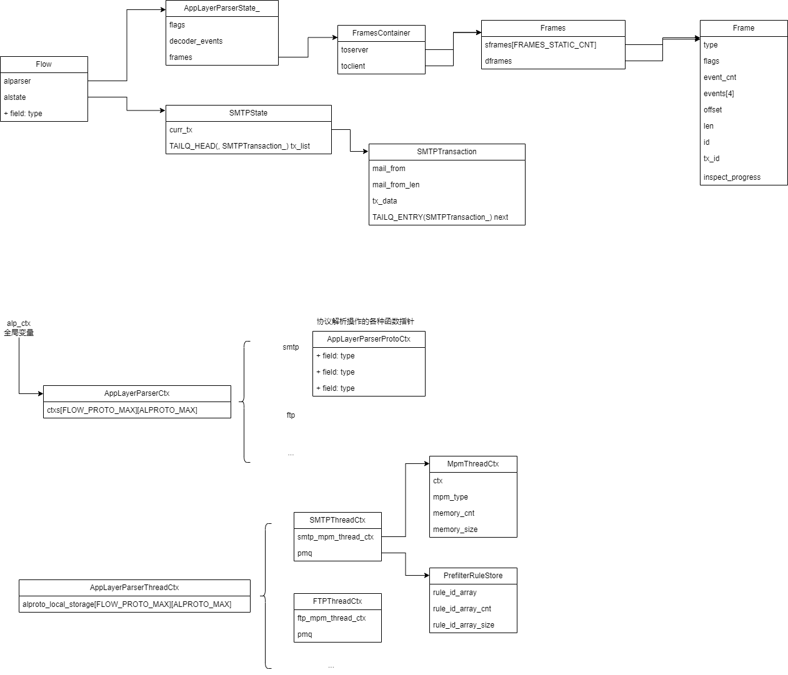

协议解码数据结构设计：

识别到应用层协议之后，则可以把数据送入到对应的解码器进行协议解码。协议解码主要目的是还原协议关键字段，支持后续的规则检测和其他业务。

suricata中用事务作为处理解码后数据的基本单位，用transations表示，简写为tx。每次解码后的数据保存在tx中，多个tx用链表管理，链表放在抽象的**解码状态**中，这样的状态，每条流中的每个应用层协议只有一个，并挂载在Flow结构体上。

解码中可能创建应用层帧(application layer frame)，帧存在不同的类型，由开发自行定义，多个帧不超出默认帧数量大小的用数组管理，超出部分用动态分配内存并用链表管理。帧区分方向，并挂载在Flow结构体上。

在解码过程中，也可能需要进行模式匹配，模式匹配可以使用util-mpm 相关的工具函数，这个仅仅为解码服务，于应用识别和漏洞检测的规则匹配无关。比如smtp解码中，确认进入哪种处理命令的逻辑，则需要匹配不同的命令字符串来调度。
