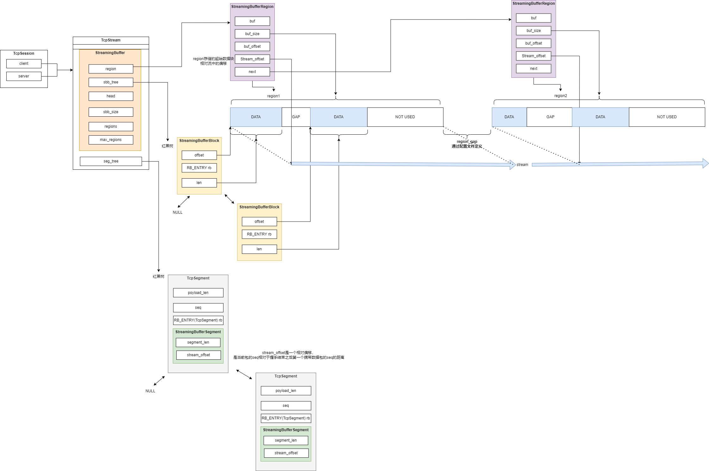

# 1 Overview
首先请阅读官网对于流引擎的介绍，在这[12.1. Suricata.yaml — Suricata 8.0.0-dev documentation](https://docs.suricata.io/en/latest/configuration/suricata-yaml.html#stream-engine) 。

suricata流引擎分为流追踪引擎和流重组引擎。流追踪引擎跟踪连接状态，处理握手与挥手，流重组引擎重建流。

串联和旁路设备的流管理有差别，主要是因为对于串联设备对实时性要求更高，所以在数据包被发出去之前必须要完成检测。在suricata中就体现为：
1. normal/IDS mode: 检测chunks。
2. inline/IPS mode: 通过滑动窗口检测。
简单来说，串联设备重组时必须充分考虑时间问题，它没有那么多时间等待未到来的数据包完成部分重组，必要时得丢弃数据包。

**本文分析suricata的normal检测模式。**

# 2 整体概览

tcp流重组的主要过程：
1. 收到tcp包之后，decode模块完成tcp协议头部的解析，然后把数据传递给FlowWork模块。
2. FlowWork模块通过五元组管理会话，并把数据交给tcp流管理引擎处理。
3. tcp流追踪引擎根据tcp协议状态调度处理流程，发现tcp段数据，则交给tcp流重组引擎进行数据重组。
4. 流重组引擎首先检查是否需要推送数据到应用层，主要依据是收到包的tcp.ack字段，然后创建一个新的TcpSegment保存段信息，数据则保存在StreamingBuffer中。
5. 最后在FlowWorker中完成检测和日志输出之后遍历保存TcpSegment的红黑树节点，释放不再需要的segments

# 3 会话(session)
会话使用TcpSession定义，TcpSession中包含两条流，一条请求流，一条响应流。会话挂载在Flow上面。对应protoctx字段，表示协议特定的数据。

# 4 流(stream)
流使用TcpStream定义，表示某个方向的tcp字节流。下面是TcpStream中部分字段：
```c
typedef struct TcpStream_ {
    StreamingBuffer sb;
    struct TCPSEG seg_tree;         /**< red black tree of TCP segments. Data is stored in TcpStream::sb */
} TcpStream;
```
sb用于保存tcp协议传输的负载数据，seg_tree是红黑树，用于保存tcp段信息，包括序列号，段长度，相对流偏移等。

# 5 StreamingBuffer
数据使用StreamingBufferBlock表示，这里的数据也就是传入的tcp包的负载，但是SBB中并不包含数据内容，数据内容存放在region中，SBB中存放数据在region中的位置。SBB使用红黑树结构管理。使用红黑树的目的是提高插入和查询region中的特定数据块的速度。

# 6 region
```c
typedef struct StreamingBufferRegion_ {
    uint8_t *buf;           /**< memory block for reassembly */
    uint32_t buf_size;      /**< size of memory block */
    uint32_t buf_offset;    /**< how far we are in buf_size */
    uint64_t stream_offset; /**< stream offset of this region */
    struct StreamingBufferRegion_ *next;
} StreamingBufferRegion;
```
region使用链表管理，也就是说可以一条流中可以存在多个region，单个region默认支持存放2k数据，但是支持扩容。

## 6.1 region中间的gap
在StreamingBufferConfig配置结构中，有一个region_gap字段，代表一个新region被创建所需要的最大gap。当新的SBB需要插入时，根据当前段所在流偏移位置计算段插入位置，如果当前流偏移位置相对已经存在的region来说相隔太远，suricata会新创建一个region来插入数据，然后把新创建的region插入链表。

使用gap可以避免连续内存块中有太大的已分配但是未使用内存。

# 7 数据如何推送到应用层
在每次流重组引擎调度处理段数据时，都会通过函数StreamTcpReassembleHandleSegmentUpdateACK基于收到的ACK更新应用层数据，应用层数据的处理进度记录在流的app_progress_rel字段中，该字段可以理解为，应用层处理进度相对流基础偏移的相对偏移位置，代表该偏移之前的数据已经被处理。

通过app_progress_rel从StreamingBuffer中的sbb_tree红黑树中获取可以推送的数据，然后根据当前的ack矫正真正可以推送的数据。

# 8 TcpSegment的销毁
在FlowWorker中完成检测和日志输出之后再调用StreamTcpPruneSession销毁或者说回收空闲的tcp段。因为检测还需要使用到这些段数据。